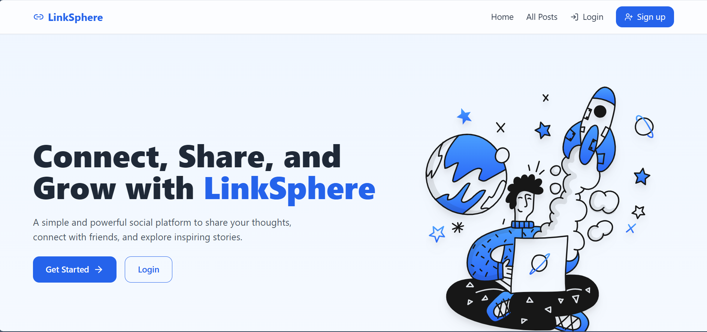
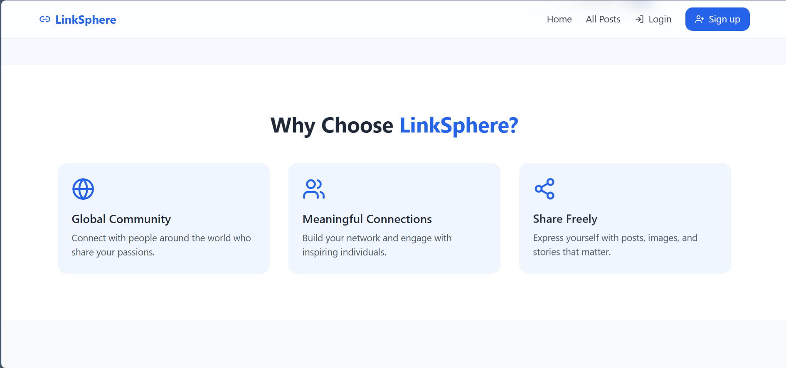
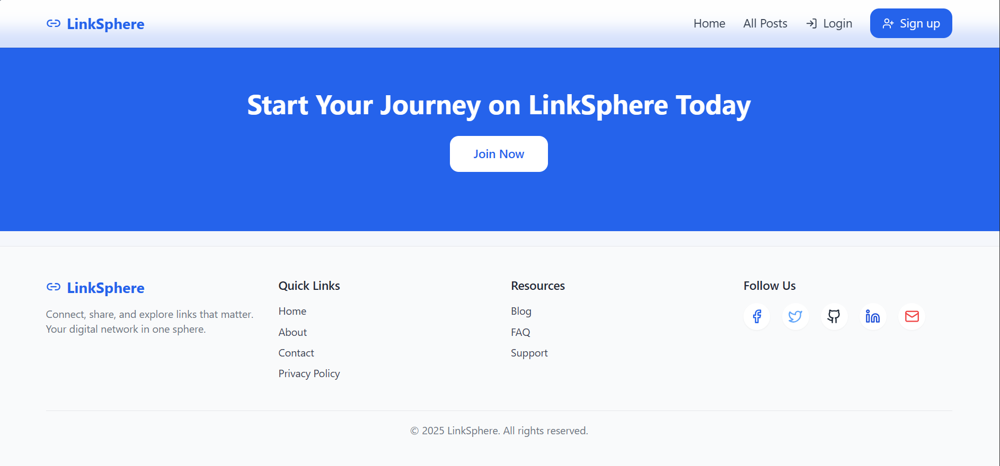
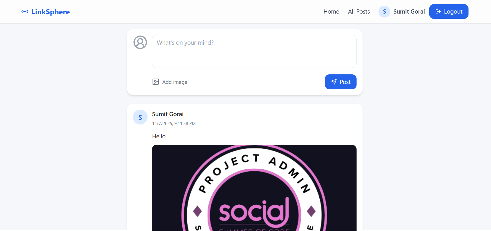

# 💼 LinkSphere – LinkedIn Clone (Full Stack Internship Project)

A simple full-stack social media web app inspired by LinkedIn.  
Users can **sign up, log in, create posts (with optional images), and view all posts** in a shared public feed.

---

## 🚀 Live Links

- **Frontend (Vite + React):** []()   
- **GitHub Repository:** [https://github.com/SumitGorai01/AppDost_Assignment_SocialMedia_Clone.git](https://github.com/SumitGorai01/AppDost_Assignment_SocialMedia_Clone.git)

---

## 🧰 Tech Stack

### Frontend
- **React.js (Vite)** – for fast, modern UI development  
- **Tailwind CSS** – for responsive and clean styling  
- **Axios** – for API communication  
- **React Router DOM** – for navigation

### Backend
- **Node.js + Express.js** – for RESTful APIs  
- **MongoDB (Mongoose)** – for storing users and posts  
- **JWT (JSON Web Tokens)** – for authentication  
- **Cloudinary** – for image uploads and storage  
- **bcrypt.js** – for password hashing  
- **dotenv** – for environment configuration

---

## ✨ Core Features

✅ **User Authentication**
- Secure login and signup with JWT-based auth  
- Passwords stored securely with bcrypt  

✅ **Create & View Posts**
- Authenticated users can create text posts  
- Posts display username, content, and timestamp  
- Feed shows all users’ posts (newest first)

✅ **Image Uploads (Cloudinary)**
- Optional image upload while creating posts  
- Automatically stored in Cloudinary and shown in feed  

✅ **Responsive UI**
- Clean, mobile-friendly layout with Tailwind CSS  

---

## 🌟 Bonus (Optional Features)
- Like & Comment buttons (can be added easily)
- Edit/Delete own posts  
- Profile page for each user  

---

## ⚙️ Installation and Setup Guide

Follow these steps to run the project locally.

### 1. Clone the repository
```bash
git clone https://github.com/SumitGorai01/AppDost_Assignment_SocialMedia_Clone.git
```
```
cd AppDost_Assignment_SocialMedia_Clone

```
### 2. Setup Backend
```
cd backend
```
```
npm install
```

### Create a .env file inside the backend folder:

- PORT=5000
- MONGO_URI=your_mongodb_connection_string
- JWT_SECRET=your_jwt_secret
- CLIENT_URL=http://localhost:5173
- CLOUDINARY_CLOUD_NAME=your_cloud_name
- CLOUDINARY_API_KEY=your_api_key
- CLOUDINARY_API_SECRET=your_api_secret


Then run:
```
npm run dev
```

### 3. Setup Frontend
```
cd ../frontend
```
```
npm install
```

### Create a .env file inside the frontend folder:
```
VITE_API_URL=http://localhost:5000/api
```

Run the app:
```
npm run dev
```

Visit: http://localhost:5173

🧩 Folder Structure
```
APPDOST_ASSIGNMENT_LINKEDIN_CLONE/
├── backend/
│ ├── middleware/
│ │ └── auth.js
│ │
│ ├── models/
│ │ ├── Post.js
│ │ └── User.js
│ │
│ ├── routes/
│ │ ├── auth.js
│ │ ├── posts.js
│ │ └── users.js
│ │
│ ├── .env
│ ├── .env.example
│ ├── package.json
│ ├── package-lock.json
│ ├── README.md
│ └── server.js
│
├── frontend/
│ ├── src/
│ │ ├── components/
│ │ │ ├── Footer.jsx
│ │ │ └── Navbar.jsx
│ │ │
│ │ ├── pages/
│ │ │ ├── Feed.jsx
│ │ │ ├── LandingPage.jsx
│ │ │ ├── Login.jsx
│ │ │ ├── Profile.jsx
│ │ │ └── Register.jsx
│ │ │
│ │ ├── utils/
│ │ │ └── api.js
│ │ │
│ │ ├── App.jsx
│ │ ├── index.css
│ │ └── main.jsx
│ │
│ ├── .env
│ ├── .env.example
│ ├── index.html
│ ├── package.json
│ ├── package-lock.json
│ ├── postcss.config.js
│ ├── tailwind.config.js
│ └── vite.config.js
│
└── README.md
```
## 📸 Screenshots




🧑‍💻 Author

- Sumit Gorai
- [LinkedIn](https://www.linkedin.com/in/sumitgorai01/)  
- [GitHub](https://github.com/SumitGorai01/)

📝 License

**This project is for educational and internship evaluation purposes.**